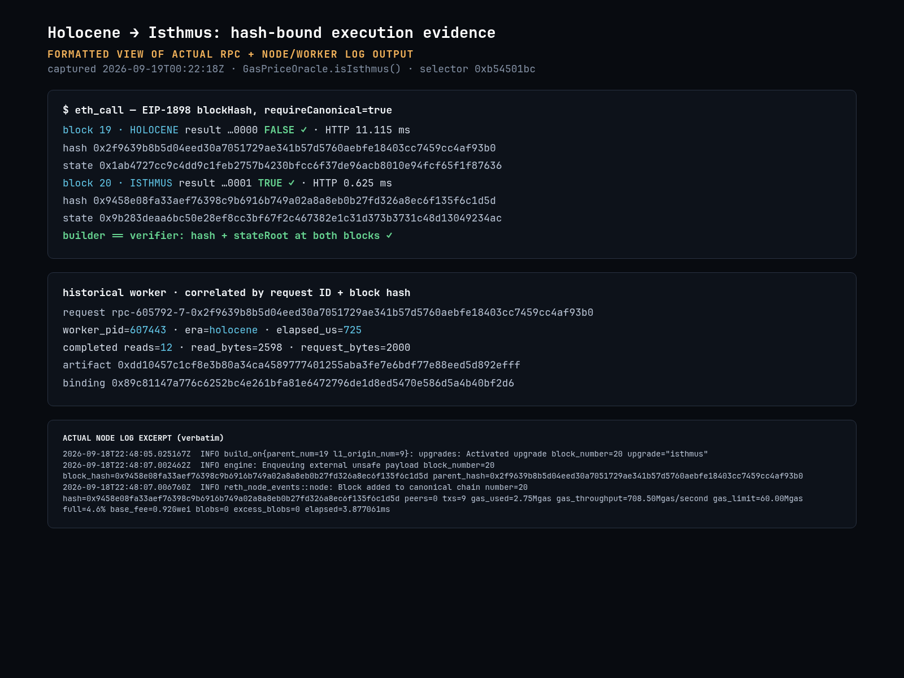
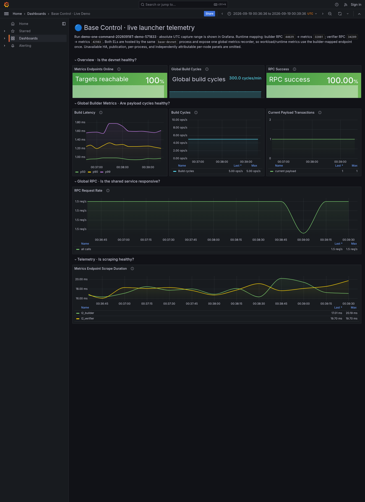

# Slack share assets

## Technical evidence — recommended pair

1. **[Execution logs](execution-logs-cutover.png)** — formatted actual RPC and node/worker output. Hash-bound calls to `GasPriceOracle.isIsthmus()` return false at Holocene block 19 and true at Isthmus block 20. The historical call is correlated with worker PID, request ID, artifact digest, binding and state-read counts. Builder/verifier block hashes and state roots match at both heights.
2. **[Base Control dashboard](base-control-dashboard.png)** — an actual Grafana screenshot, populated by Prometheus scrapes of the running local devnet. It shows build cycles, latency summaries, payload transaction counts, RPC activity and scrape health over an absolute UTC window. This is an adapted subset of the repository's Base Control dashboard, not a mockup.





### Scope and audit trail

- [RPC results](execution-logs-evidence.json), [exact worker logs](execution-logs-evidence.worker.log), [exact cutover/import logs](execution-logs-evidence.imports.log), and [formatted screenshot source](execution-logs-formatted.html).
- [Dashboard definition](base-control-dashboard.json) and [timestamped PromQL responses](dashboard-evidence-queries.json).
- The two EL instances run in **one launcher process** with a shared global metrics recorder. Workload metrics are read from one endpoint, not summed or presented as independent per-node measurements. The historical worker is a separate process. Grafana is evidence of telemetry/liveness, not consensus correctness or worker routing.
- The log image combines a fresh historical RPC capture with earlier cutover logs, with their original timestamps. The combined launcher log does not label each import by node. RPC checks establish builder/verifier agreement separately.
- The 725 µs worker exchange and 11.115 ms HTTP time are one warmed call, not benchmark medians or EVM-only timing. The dashboard and RPC capture have different observation times.
- HA, batcher, publication and independent per-node resource panels are omitted because this launcher cannot supply them reliably. No synthetic metrics or credentials are included.

### Capture again

With a running `just demo` run directory, on Linux with Docker, curl, jq, Node, Chromium and Playwright installed:

```sh
run='target/<run-directory-printed-by-just-demo>'
tools/capture-devnet-dashboard start "$run"
# Waits for approximately three minutes of real scrape history, then captures.
tools/capture-devnet-dashboard capture "$run"
python3 tools/capture-technical-logs.py "$run" site/media/execution-logs-evidence.json
# Stop only the capture's Grafana/Prometheus; leave the devnet alone.
tools/capture-devnet-dashboard stop "$run"
```

Install Playwright into a disposable directory if needed: `npm install --prefix target/browser-tools playwright@1.63.0`, then `export NODE_PATH="$PWD/target/browser-tools/node_modules"`. `CHROMIUM_PATH` overrides `/usr/bin/chromium`. Grafana is local-only at <http://127.0.0.1:33000>; Prometheus at <http://127.0.0.1:39090>. Only one capture stack can use these ports at a time. Container images are digest-pinned in the script. The log capture updates JSON/raw logs; the formatted HTML/PNG is a retained view of the original capture, not an automatically updating terminal.

## Earlier editorial assets

| Asset | Format | Use |
|---|---|---|
| [Results card](results-card.png) | PNG · 1200×675 | Editorial graphic, not operational evidence |
| [Walkthrough](walkthrough.gif) | GIF · 1200×800 · 12 seconds | Three scenes: deletion experiment, execution boundary, recorded call |
| [Walkthrough video](walkthrough.mp4) | H.264 MP4 · 1200×800 · 12 seconds · no audio | Smaller video version of the same walkthrough |
| [Video poster](walkthrough-poster.png) | PNG · 1200×800 | First scene of the walkthrough |
| [Technical evidence](../screenshots/historical-call.png) | PNG · 1072×331 | Real recorded historical-call waterfall |

The walkthrough uses edited captures of the public site, not a live devnet screencast.
The results card is an AI-generated editorial graphic checked against the measured counts.
The 5,907-line reduction is a separate source experiment: 2,743 production Rust lines plus
3,164 test/benchmark lines, including comments and blanks. It is not deployed in the runnable
demo; full historical derivation/proof routing still needs integration. See the
[deletion report](../../docs/retirement.md) and [call measurement](../../docs/history-performance.md#recorded-call-waterfall).

## Suggested post

> Can we stop accumulating old fork implementations in the active Base client?
>
> Actual logs + Grafana from Base Era's local devnet: a hash-bound pre-Isthmus call executes
> in a pinned worker process; the same contract returns the changed result at the fork boundary.
> Builder and verifier agree on both block hashes and state roots.
>
> The goal is to retire old fork logic from the active client without giving up historical
> execution. Still a spike—not a production-ready client or a zk proving solution.
>
> Demo, diff and measurements: https://refcell.github.io/base-era/
